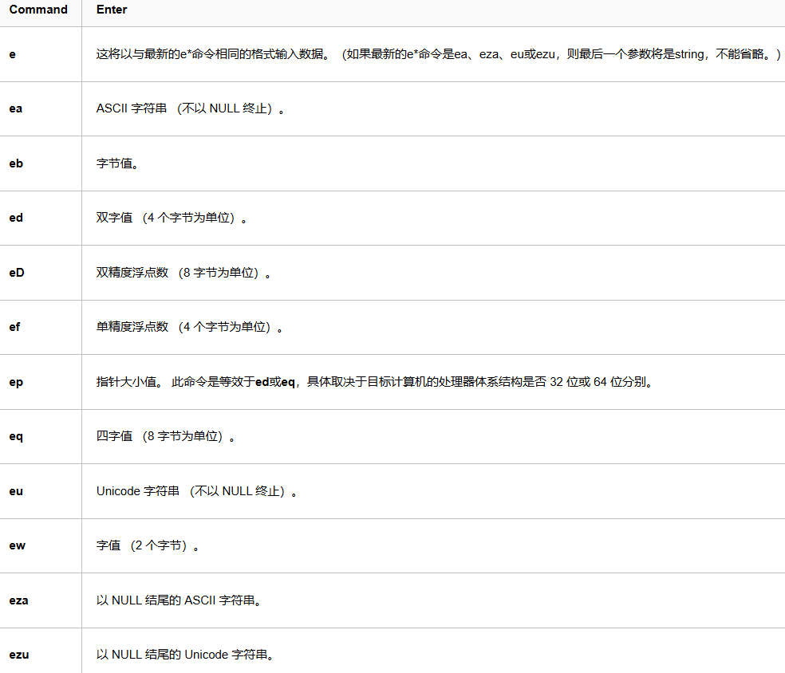
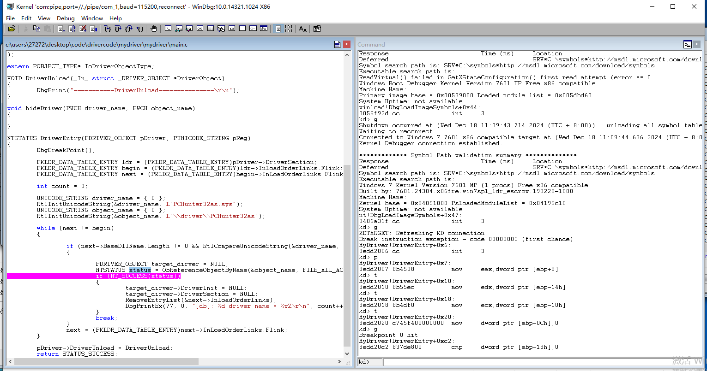
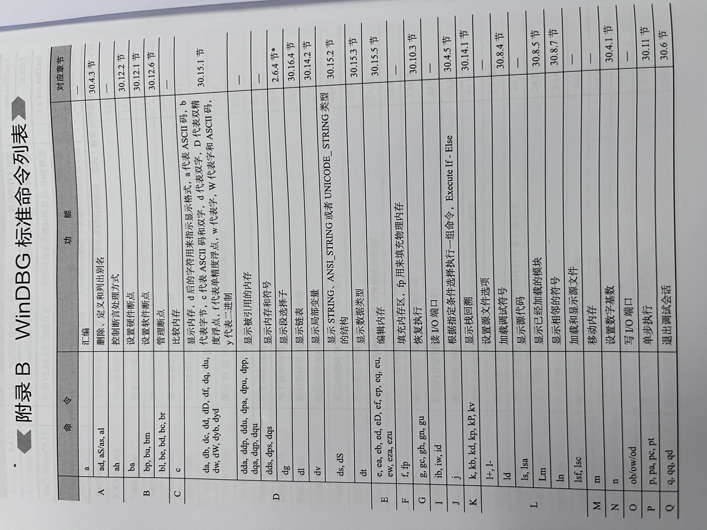
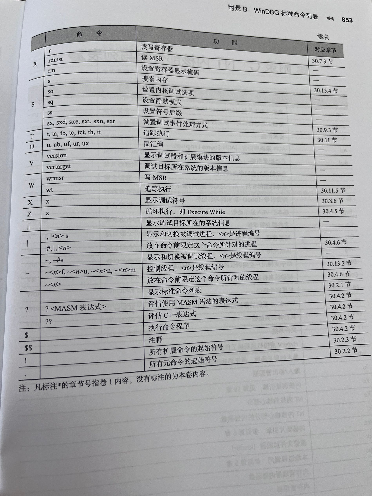

# tab键补全

# 查看寄存器
r 寄存器

# 查看地址的内存，（物理内存要在最前面加！，虚拟内存不用）
## 注意显示出来的内存全是小端序
db/dw/dd/dq 寄存器/address [l 0x20]
## 竖向查看
dds/dqs 寄存器/address [l 0x20]
## 查看物理内存
!dd address
## 显示内存的unicode
!du address

# 改变内存（物理内存要在最前面加！，虚拟内存不用）
eb/ew/ed/eq address target
## 补充

# 查看反汇编
u nt!DbgPrint

# 查看进程信息
!process 0 0

# kv
查看堆栈详情，可能会不全

# dt 
显示数据类型

# windbg快捷键
https://www.cnblogs.com/yilang/p/12076900.html
## 实测

在这个调试界面快捷键与vs一样。

# 《软件调试》附录

