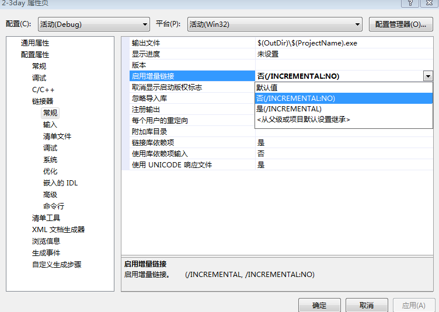

# 双击调试
## 查看系统配置
msconfig
## 复制当前引导
bcdedit /copy {current} /d debug123
## 将复制的引导配置到显示的末尾
bcdedit /displayorder {929933ba-ac64-11ef-96b1-b8795029782d} /addlast
## 设置com端口
bcdedit /dbgsettings SERIAL DEBUGPORT:1 BAUDRATE:115200
## window引导程序加载时就可以挂在调试器
bcdedit /bootdebug {929933ba-ac64-11ef-96b1-b8795029782d} ON
## 界面加载时挂在调试
bcdedit /debug {929933ba-ac64-11ef-96b1-b8795029782d} ON
## 设置超时
bcdedit /timeout 30
## 设置虚拟机的串行端口
//./pipe/com_1
## 设置windbg目标
"C:\Program Files (x86)\Windows Kits\10\Debuggers\x86\windbg.exe" -y SRV*C:\symbols*http://msdl.microsoft.com/download/symbols -b -k com:pipe,port=//./pipe/com_1,baud=115200,reconnect
## 关闭KPIT 修改注册表禁用英特尔CPU幽灵/熔断/僵尸负载漏洞补丁恢复性能 <https://bbs.pcbeta.com/viewthread-1816722-1-1.html>
打开注册表编辑器RegEdit，打开路径：\HKEY_LOCAL_MACHINE\SYSTEM\CurrentControlSet\Control\Session Manager\Memory Management

1、将FeatureSettingsOverride键值默认0修改为3（如果没有这键值，就右键新建DWORD32位，键值名称FeatureSettingsOverride）

2、右键新建DWORD32位，键值名称FeatureSettingsOverrideMask，将FeatureSettingsOverrideMask键值默认0修改为3。

# vs
## vs关闭增量链接

## vs关闭随机基址

# 101012分页
## 禁用PAE
bcdedit /set pae ForceDisable
## 禁用数据执行保护
bcdedit /set nx AlwaysOff