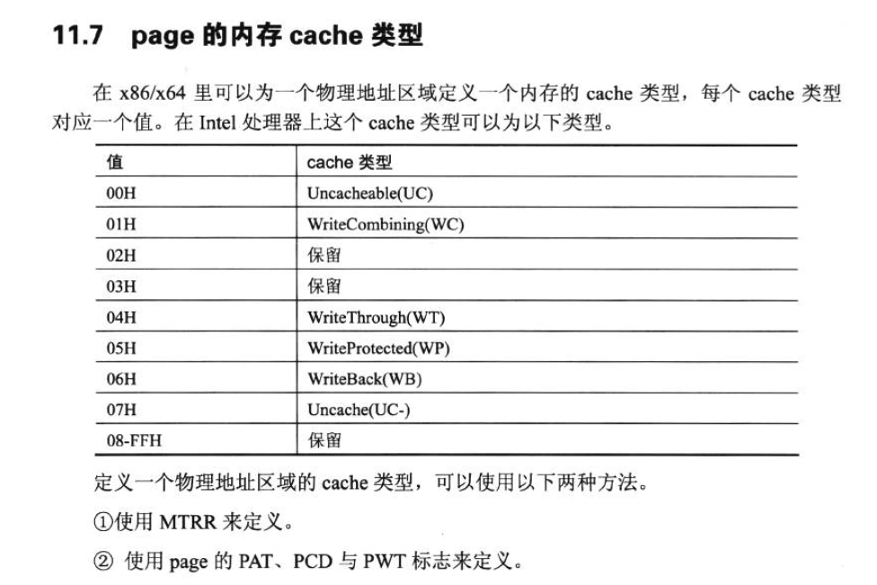
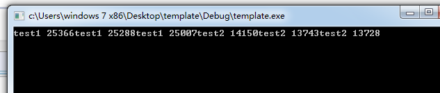

# 缓存

## WC
写组合：写缓存行，最多同时写入四个地址，WC更快，但资源比较少，当耗尽时，使用WB或WT。
## WB
回写：标记后，到适当的时机写入缓存
## WT
直写：直接写入缓存

# 总结
当用线性地址去计算得到真实地址后，会将其写入缓存，再用到相同线性地址时，直接访问缓存。

# 写组合实验
```c++
// template.cpp : 定义控制台应用程序的入口点。
//

#include "stdafx.h"
#include <Windows.h>

#define ALLOCATE_SIZE	0x1000000
#define MASK			(ALLOCATE_SIZE - 1)

void test1()
{
	PUCHAR x1 = (PUCHAR)malloc(ALLOCATE_SIZE);
	PUCHAR x2 = (PUCHAR)malloc(ALLOCATE_SIZE);
	PUCHAR x3 = (PUCHAR)malloc(ALLOCATE_SIZE);
	PUCHAR x4 = (PUCHAR)malloc(ALLOCATE_SIZE);
	PUCHAR x5 = (PUCHAR)malloc(ALLOCATE_SIZE);
	PUCHAR x6 = (PUCHAR)malloc(ALLOCATE_SIZE);

	int startTime = GetTickCount();
	int i = INT_MAX;
	while (i--)
	{
		int index = i & MASK;
		char b = i;
		x1[index] = b;
		x2[index] = b;
		x3[index] = b;
	}

	i = INT_MAX;
	while (i--)
	{
		int index = i & MASK;
		char b = i;
		x4[index] = b;
		x5[index] = b;
		x6[index] = b;
	}

	int endTime = GetTickCount();
	printf("test1 %d", endTime - startTime);

	free(x1);
	free(x2);
	free(x3);
	free(x4);
	free(x5);
	free(x6);
}

void test2()
{
	PUCHAR x1 = (PUCHAR)malloc(ALLOCATE_SIZE);
	PUCHAR x2 = (PUCHAR)malloc(ALLOCATE_SIZE);
	PUCHAR x3 = (PUCHAR)malloc(ALLOCATE_SIZE);
	PUCHAR x4 = (PUCHAR)malloc(ALLOCATE_SIZE);
	PUCHAR x5 = (PUCHAR)malloc(ALLOCATE_SIZE);
	PUCHAR x6 = (PUCHAR)malloc(ALLOCATE_SIZE);

	int startTime = GetTickCount();
	int i = INT_MAX;
	while (i--)
	{
		int index = i & MASK;
		char b = i;
		x1[index] = b;
		x2[index] = b;
		x3[index] = b;
		x4[index] = b;
		x5[index] = b;
		x6[index] = b;
	}
	int endTime = GetTickCount();
	printf("test2 %d", endTime - startTime);

	free(x1);
	free(x2);
	free(x3);
	free(x4);
	free(x5);
	free(x6);
}

int _tmain(int argc, _TCHAR* argv[])
{
	test1();
	test1();
	test1();
	test2();
	test2();
	test2();
	return 0;
}
```
