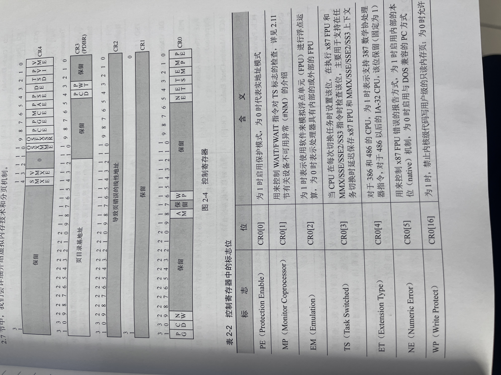

# IA-32 cpu设计了5个控制寄存器（cr0~cr4）
决定当前cpu的操作模式以及体现当前任务的关键特征

## cr1
保留未使用
## cr0 cr4
cr0和cr4与cpu的工作模式密切相关。

## cr2 cr3
cr2和cr3与分页机制有关，cr3用来切换和定位当前正在使用的页表，当软件访问某个内存地址时，cpu会通过页表做地址翻译，当访问的内存不在物理内存而报告缺页异常时，cpu会通过cr2寄存器向操作系统报告访问失败的线性地址。

## cr0的PE与PG
|  PE   | PG  | 描述 |
|  ----  | ----  | ----  |
| 0 | 1 | 错误 |
| 0 | 0 | 实模式 |
| 1 | 0 | 段模式 |
| 1 | 1 | 段页模式 |