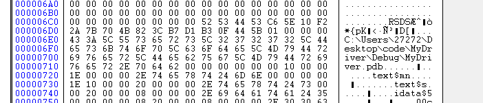
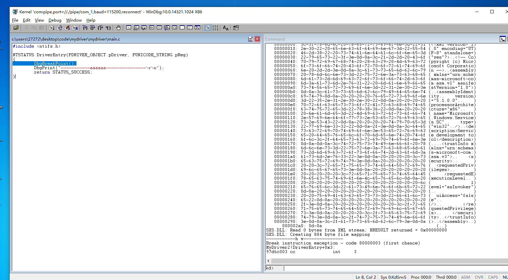
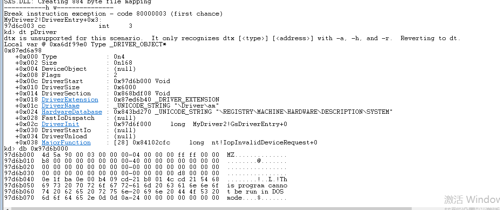
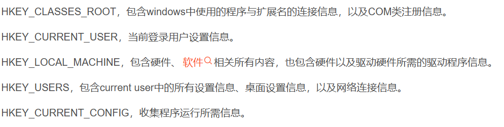
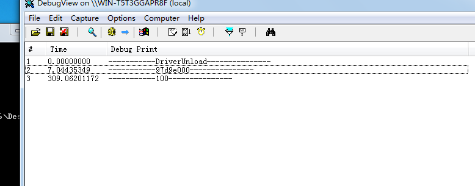

# 驱动种类
## NT
不能卸载，更新后只能重启。
## WDM
热拔插，更新后不需要重启。
## wDF
封装WDM，简化开发

# 第一个驱动程序
## 参考链接
https://www.cnblogs.com/zhaotianff/p/17942863
## 驱动代码
```c
#include <ntifs.h>

VOID DriverUnload(_In_ struct _DRIVER_OBJECT *DriverObject)
{
	DbgPrint("-----------DriverUnload---------------\r\n");
}

NTSTATUS DriverEntry(PDRIVER_OBJECT pDriver, PUNICODE_STRING pReg)
{
	DbgBreakPoint();
	pDriver->DriverUnload = DriverUnload;
	DbgPrint("-----------%wZ---------------\r\n", pReg);
	return STATUS_SUCCESS;
}
```
## 注意要关闭是警告为错误

## 32位上跑要设置目标为win7


## 运行命令来加载驱动
```shell
sc create MyFirstDriver binPath= "driverpath" type= kernel
sc start MyFirstDriver
sc stop MyFirstDriver
sc delete  MyFirstDriver
# net与sc有异曲同工之妙
net start MyFirstDriver

# 蓝屏命令
KeBugCheckEx(INVALID_DATA_ACCESS_TRAP, NULL, NULL, NULL, NULL); 
```

## 在生成的.sys文件中藏有调试信息，需要抹除


## 保留调试信息可以进行源码调试



## 在注册表中注册服务
在HKEY_LOCAL_MACHINE \ SYSTEM \CurrentControlSet lServices中会看到之前注册的驱动服务

### 其中start


# windows如何启动驱动
## 服务加载
按上边命令行调用api的方式就是服务加载
## 本地加载
调用Zw/NtLoadDriver; Zw/NtUnloadDriver，这种方法必须自己创建、删注册表

# 补充注册表简介


# 作业-内核共享
```c
#include <ntifs.h>

int x = 100;

VOID DriverUnload(_In_ struct _DRIVER_OBJECT *DriverObject)
{
	DbgPrint("-----------DriverUnload---------------\r\n");
}

NTSTATUS DriverEntry(PDRIVER_OBJECT pDriver, PUNICODE_STRING pReg)
{
	DbgBreakPoint();
	pDriver->DriverUnload = DriverUnload;
	DbgPrint("-----------%x---------------\r\n", &x);
	return STATUS_SUCCESS;
}
```

```c
#include <ntifs.h>

VOID DriverUnload(_In_ struct _DRIVER_OBJECT *DriverObject)
{
	DbgPrint("-----------DriverUnload---------------\r\n");
}

NTSTATUS DriverEntry(PDRIVER_OBJECT pDriver, PUNICODE_STRING pReg)
{
	DbgBreakPoint();
	
	int x = *(int*)0x97d9e000;
	pDriver->DriverUnload = DriverUnload;
	DbgPrint("-----------%d---------------\r\n", x);
	return STATUS_SUCCESS;
}
```

