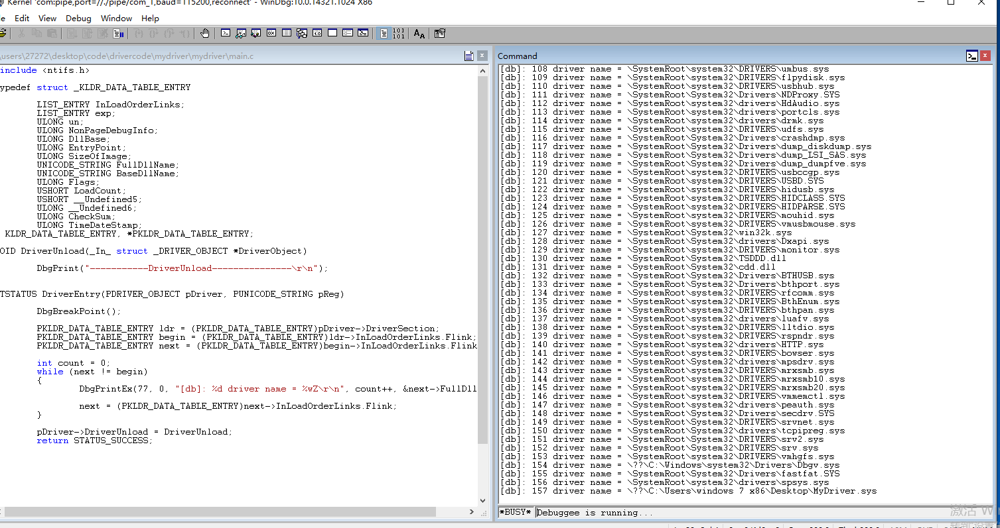
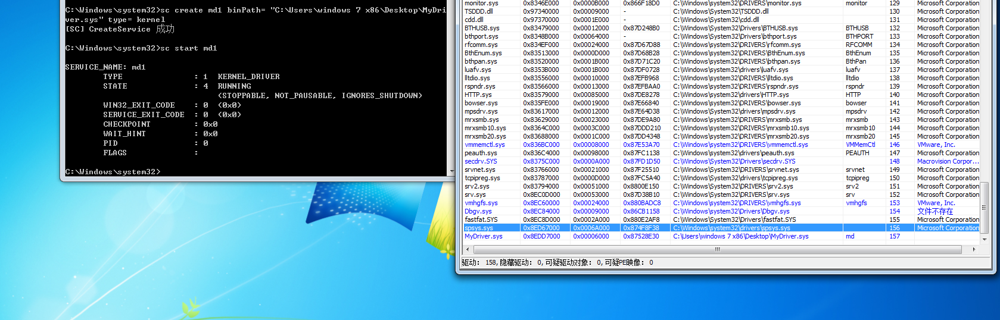

# 每一个驱动程序是由双向循环链表连接在一起的
```c
typedef struct _LIST_ENTRY {
   struct _LIST_ENTRY *Flink;
   struct _LIST_ENTRY *Blink;
} LIST_ENTRY, *PLIST_ENTRY, *RESTRICTED_POINTER PRLIST_ENTRY;
```
在结构体头部包含这个结构的指针。

# 遍历驱动
```c
#include <ntifs.h>

typedef struct _KLDR_DATA_TABLE_ENTRY
{
	LIST_ENTRY InLoadOrderLinks;
	LIST_ENTRY exp;
	ULONG un;
	ULONG NonPageDebugInfo;
	ULONG DllBase;
	ULONG EntryPoint;
	ULONG SizeOfImage;
	UNICODE_STRING FullDllName;
	UNICODE_STRING BaseDllName;
	ULONG Flags;
	USHORT LoadCount;
	USHORT __Undefined5;
	ULONG __Undefined6;
	ULONG CheckSum;
	ULONG TimeDateStamp;
} KLDR_DATA_TABLE_ENTRY, *PKLDR_DATA_TABLE_ENTRY;

VOID DriverUnload(_In_ struct _DRIVER_OBJECT *DriverObject)
{
	DbgPrint("-----------DriverUnload---------------\r\n");
}

NTSTATUS DriverEntry(PDRIVER_OBJECT pDriver, PUNICODE_STRING pReg)
{
	DbgBreakPoint();

	PKLDR_DATA_TABLE_ENTRY ldr = (PKLDR_DATA_TABLE_ENTRY)pDriver->DriverSection;
	PKLDR_DATA_TABLE_ENTRY begin = (PKLDR_DATA_TABLE_ENTRY)ldr->InLoadOrderLinks.Flink;
	PKLDR_DATA_TABLE_ENTRY next = (PKLDR_DATA_TABLE_ENTRY)begin->InLoadOrderLinks.Flink;

	int count = 0;
	while (next != begin)
	{
		DbgPrintEx(77, 0, "[db]: %d driver name = %wZ\r\n", count++, &next->FullDllName);

		next = (PKLDR_DATA_TABLE_ENTRY)next->InLoadOrderLinks.Flink;
	}

	pDriver->DriverUnload = DriverUnload;
	return STATUS_SUCCESS;
}
```


# 驱动断链
## 第一种
```c
#include <ntifs.h>

typedef struct _KLDR_DATA_TABLE_ENTRY
{
	LIST_ENTRY InLoadOrderLinks;
	LIST_ENTRY exp;
	ULONG un;
	ULONG NonPageDebugInfo;
	ULONG DllBase;
	ULONG EntryPoint;
	ULONG SizeOfImage;
	UNICODE_STRING FullDllName;
	UNICODE_STRING BaseDllName;
	ULONG Flags;
	USHORT LoadCount;
	USHORT __Undefined5;
	ULONG __Undefined6;
	ULONG CheckSum;
	ULONG TimeDateStamp;
} KLDR_DATA_TABLE_ENTRY, *PKLDR_DATA_TABLE_ENTRY;

NTKERNELAPI NTSTATUS ObReferenceObjectByName(
	IN PUNICODE_STRING ObjectName,
	IN ULONG Attributes,
	IN PACCESS_STATE PassedAccessState OPTIONAL,
	IN ACCESS_MASK DesiredAccess OPTIONAL,
	IN POBJECT_TYPE ObjectType,
	IN KPROCESSOR_MODE AccessMode,
	IN OUT PVOID ParseContext OPTIONAL,
	OUT PVOID *Object
);

extern POBJECT_TYPE* IoDriverObjectType;

VOID DriverUnload(_In_ struct _DRIVER_OBJECT *DriverObject)
{
	DbgPrint("-----------DriverUnload---------------\r\n");
}

void hideDriver(PWCH object_name_)
{
	LARGE_INTEGER in = { 0 };
	in.QuadPart = -10000 * 5000;
	KeDelayExecutionThread(KernelMode, FALSE, &in);

	UNICODE_STRING object_name = { 0 };
	RtlInitUnicodeString(&object_name, object_name_);
	PDRIVER_OBJECT target_dirver = NULL;
	NTSTATUS status = ObReferenceObjectByName(&object_name, FILE_ALL_ACCESS, 0, 0, *IoDriverObjectType, KernelMode, NULL, &target_dirver);
	if (NT_SUCCESS(status))
	{
		PKLDR_DATA_TABLE_ENTRY ldr = (PKLDR_DATA_TABLE_ENTRY)target_dirver->DriverSection;
		target_dirver->DriverInit = NULL;
		target_dirver->DriverSection = ldr->InLoadOrderLinks.Flink;
		RemoveEntryList(&ldr->InLoadOrderLinks);
		ObDereferenceObject(target_dirver);

		DbgPrintEx(77, 0, "[db]: object name = %wZ\r\n", &object_name);
	}

	return;
}

NTSTATUS DriverEntry(PDRIVER_OBJECT pDriver, PUNICODE_STRING pReg)
{
	HANDLE hThread = NULL;
	// L"\\driver\\PCHunter32as"是要隐藏的驱动对象路径
	NTSTATUS status = PsCreateSystemThread(&hThread, THREAD_ALL_ACCESS, NULL, NULL, NULL, hideDriver, L"\\driver\\PCHunter32as");
	if (NT_SUCCESS(status))
	{
		NtClose(hThread);
	}

}
```


# 战绩可查，hh


# 建议
嗯，开始学习数据结构与算法只是为了应付大厂招聘的要求，随着我编译原理、os学习的逐渐深入，发现如何优雅的设计算法、选用数据结构决定了你整个程序的质量，而类似前后端这种偏业务的工作，大概是采用怎样的设计模式比较重要，数据结构与算法用的可能会不是很多，相对来说数据结构与算法偏底层用的多一些。

扯了这么一大堆，那么该如何学习数据结构与算法呢，苦哈哈的刷题是在太无聊了，笔者也是在刷了100多道后停止。对于我来说更好的做法是：先找一本算法书（推荐https://www.hello-algo.com/），跟着敲一遍，初步了解，去尝试刷刷leetcode，体会到这种学习方法的无聊是最大的收获，否则你可能总是想着。然后放松时间多看些别人刷题的视频或者讲解数据结构和算法的视频，主要是领略到思路，当你做自己的东西时可以想到多种不同的解决方法，多看为你实践时的灵感迸发做养料，记不住没关系细节没关系，可以去查。

