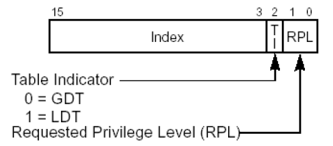

# 段选择子

比如cs为4B即：01001 011（改变cs需要通过远跳转的方式，如jmp far 0x4b:0x123456）

index：01001 = 10

TI: 0

RPL: 11

# 段描述符
通过段选择子在段描述符表中找到段描述符
## D/B位
### 对CS段的影响
如果D/B位为1 采用32位寻址方式

如果D/B位为0 采用16位寻址方式

### 对SS段的影响
如果D/B = 1 隐式堆栈访问指令（如：PUSH POP CALL） 使用32位堆栈指针寄存器ESP

如果D/B = 0 隐式堆栈访问指令（如：PUSH POP CALL） 使用16位堆栈指针寄存器SP

### 对其他段寄存器没有影响

## type位

### 表中accessed
表示这个描述符是否被使用过，如果使用过就会变为对应有accessed标记的值（0->1, 2->3, ...）
### 表中expend-down
有expend-down标记意味着描述符base-limit区间内的地址不能访问，base-limit区间外的地址可以访问
### 表中conforming
纯段模式才发挥作用，让应用层直接访问内核，现代计算机使用段页模式，conforming无法发挥作用

## G位
描述符limit的单位。为1，limit以页为单位；为0，limit以字节为单位

## DPL位
规定了访问该段所需要的特权级别是什么。如果通俗的理解，就是：如果你想访问我，那么你应该具备什么权限

# 权限
## CPL、RPL
### CPL
当前特权级别，为cs段寄存器对应段描述符的DPL
### RPL
请求特权级别，在段选择子中，以什么样的权限请求段描述符，段描述符会依据它自己的DPL判定（普通数据段不判断，堆栈段会判断），堆栈段必须RPL == CPL == DPL，代码段上CPL == DPL，RPL会自动被置回