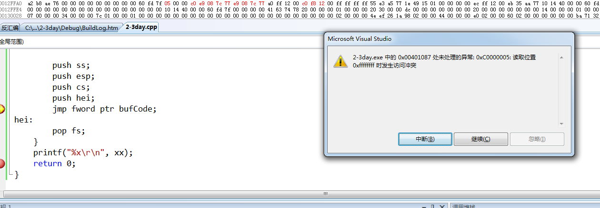

# 调用门 S = 0 && type = c
## 段描述符按以下图片内容解析

## 其中Semment Selector
目标段选择子，要改变成哪个段选择子。
## 其中Param Count
参数数量
## 举例401000提权到描述符表[1]的的描述符
0040ec00`00081000

## 调用门提权
调用门会以cs为基础值加8（描述符表中下一个）修改ss，改变cs、ss对应的段描述符，当他们的dpl为0，

## call fword ptr
### 跨段不提权: push cs; push eip
### 跨段提权: push ss; push esp; (push 参数;) push cs; push eip;

# call跨段跳转提权
```c++
#include "stdafx.h"

int xx = 0;

void __declspec(naked) test()
{
	__asm
	{
		int 3;
		mov eax, dword ptr ds:[0x84030c8f];
		mov xx, eax;
		retf;
	}
}

int _tmain(int argc, _TCHAR* argv[])
{
	printf("%x\r\n", test);

	char bufCode[6] = { 0, 0, 0, 0, 0x48, 0};
	*(int *)&bufCode[0] = (int)test;
	xx = 0;
	__asm 
	{
		push fs;
		call fword ptr bufCode;
		pop fs;
	}
	printf("%x\r\n", xx);
	return 0;
}
```

# 作业
## jmp、ret、retf能否跨段跳转提权
只写了jmp，剩下两个写法差不多。
```c++
#include "stdafx.h"

int xx = 0;

void __declspec(naked) test()
{
	__asm
	{
		int 3;
		mov eax, dword ptr ds:[0x84030c8f];
		mov xx, eax;
		retf;
	}
}

int _tmain(int argc, _TCHAR* argv[])
{
	printf("%x\r\n", test);

	char bufCode[6] = { 0, 0, 0, 0, 0x48, 0};
	*(int *)&bufCode[0] = (int)test;
	xx = 0;
	__asm 
	{
		push fs;

		push ss;
		push esp;
		push cs;
		push hei;
		jmp fword ptr bufCode;
hei:
		pop fs;
	}
	printf("%x\r\n", xx);
	return 0;
}
```


## 结果
jmp在调用门只能同权限跳转，ret不能改变cs内容，retf同权限或向低权限跳转，call同权限或向高权限跳转