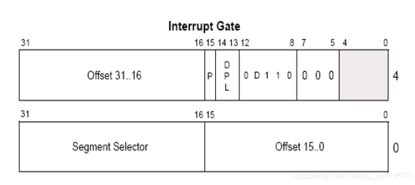

# 段描述符


## 其中D
64、32为1，16位为0

## 其中Segment Selector
是全局描述符表的选择子，进入中断门后，会把cs改变为这个，一般是0008

## 其中Offset
是中断后跳转的地址

# 使用int
int3是int 3的快捷写法，是指令的优化，int后是几就在中断描述符表中查找第几项段描述符。

# int指令0换栈变，3换栈不变
push ss; push esp; push eflags; push cs; push eip

# gdt（全局描述符表）与idt（中断描述符表）改变与读取指令
## 读取（3环可用）
sgdt\sidt
```c++
#pragma pack(1)
typedef struct _DtInfo
{
	short limit;
	unsigned int base;
} DtInfo;

int _tmain(int argc, _TCHAR* argv[])
{
	DtInfo bufgdt;
	DtInfo bufidt;
	__asm
	{
		sgdt bufgdt;
		sidt bufidt;
	}
	return 0;
}
```
## 修改位置（3换不可用）
lgdt\lidt

# retf
远返回，call far 对应的 retf，当然分为两种情况
## 相同权限返回
从栈顶弹出 EIP >> CS (先 >> 后)
## 不同权限返回
从栈顶弹出 EIP >> CS >> ESP >> SS

# iretd
中断返回，int n 对应 iretd；任务切换(nested task swith)的call far也用iretd返回
## NT = 0
从栈顶弹出 EIP >> CS >> EFLAGS >> ESP >> SS
## NT = 1
任务切换返回，使用到TSS表。详情请查看任务段调用及返回

# 作业
```c++
#include "stdafx.h"
#include <Windows.h>

void __declspec(naked) test()
{
	__asm
	{
		int 3;
		pop eax;
		pop ebx;
		pop ecx;
		push ebx;
		push eax;
		retf;
	}
}

int _tmain(int argc, _TCHAR* argv[])
{
	system("pause");
	__asm 
	{
		push fs;
		int 32;
		pop fs;
	}
	system("pause");
	return 0;
}
```

