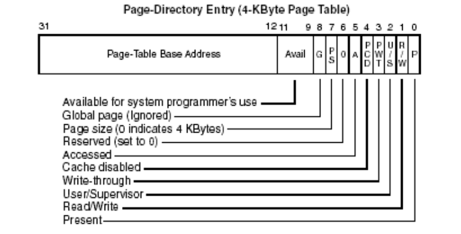
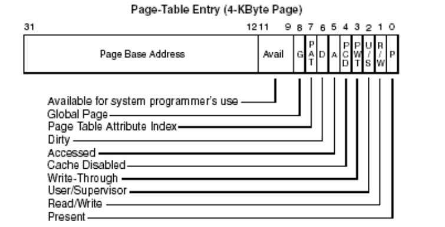

# PDE

# PTE

# 要点
## 1.属性
最终页的属性是PDE属性与PTE属性的交集
## 2.P位
PDE、PTE的P位代表指向的地址是否有效，这项用于及时加载
## 3.R/W位
是否可以写，为0代表只能读，为1代表可以读写
## 4.U/S位
为1则3环可以访问，为0则只有0环能访问
## 5.A位
如果从没访问过并且初始值为0，在第一次读或者写后自动变成1
## 6.PTE的D位
如果从没访问过并且初始值为0，在第一次写后自动变成1
## 7.Avail
给操作系统用，intel没有使用

# 及时加载
只有用到的时候才分配物理内存，否则只有线性地址，物理内存不够用的时候，把一些不经常用到的值写入磁盘 
