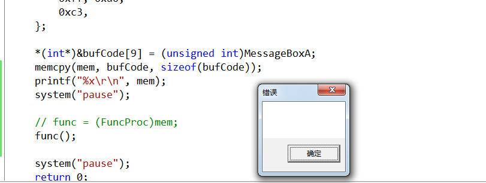

# 实操挂页
改变0地址PTE的值，让0地址可以运行、赋值
## 挂自己的进程的PTE
```c++
// template.cpp : 定义控制台应用程序的入口点。
//

#include "stdafx.h"
#include <Windows.h>

typedef void(__stdcall* FuncProc)();

int _tmain(int argc, _TCHAR* argv[])
{
	int* mem = (int*)VirtualAlloc(NULL, 0x1000, MEM_COMMIT, PAGE_EXECUTE_READWRITE);
	FuncProc func = NULL;

	memset(mem, 0, 0x1000);

	char bufCode[] = 
	{
		0x6A, 0,
		0x6A, 0,
		0x6A, 0,
		0x6A, 0,
		0xb8, 0, 0, 0, 0,
		0xff, 0xd0,
		0xc3,
	};

	*(int*)&bufCode[9] = (unsigned int)MessageBoxA;
	memcpy(mem, bufCode, sizeof(bufCode));
	printf("%x\r\n", mem);
	system("pause");

	// func = (FuncProc)mem;
	func();

	system("pause");
	return 0;
}
```


## 挂其他进程的PTE
```c++
// template.cpp : 定义控制台应用程序的入口点。
//

#include "stdafx.h"
#include <Windows.h>

typedef void(__stdcall* FuncProc)();

int _tmain(int argc, _TCHAR* argv[])
{
	int* mem = (int*)VirtualAlloc(NULL, 0x1000, MEM_COMMIT, PAGE_EXECUTE_READWRITE);
	FuncProc func = NULL;

	memset(mem, 0, 0x1000);

	char bufCode[] = 
	{
		0x6A, 0,
		0x6A, 0,
		0x6A, 0,
		0x6A, 0,
		0xb8, 0, 0, 0, 0,
		0xff, 0xd0,
		0xc3,
	};

	*(int*)&bufCode[9] = (unsigned int)MessageBoxA;
	memcpy(mem, bufCode, sizeof(bufCode));
	printf("%x\r\n", mem);
	system("pause");

	// func = (FuncProc)mem;
	// func();
	HANDLE hProcess = OpenProcess(PROCESS_ALL_ACCESS, FALSE, 3960);
	HANDLE hThread = CreateRemoteThread(hProcess, NULL, NULL, NULL, NULL, NULL, NULL);
	CloseHandle(hThread);
	CloseHandle(hProcess);

	system("pause");
	return 0;
}
```
原理类似

# 总结
真实地址永远只有一套，线性地址/虚拟地址是对真实地址的封装，像是一个类，存入了真实地址和其对应的信息。之所以是PTE而不是颗粒度更小的页，是因为到了页地址就是真实地址了，替换的最小颗粒度是PTE，也就是说PTE在算就是真实地址了。
