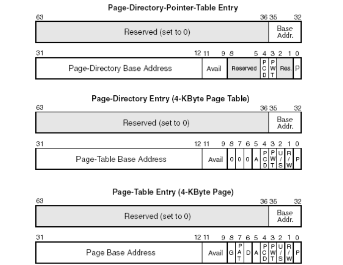
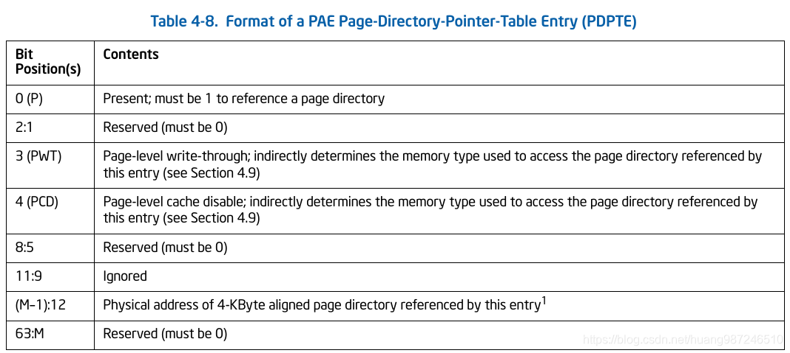
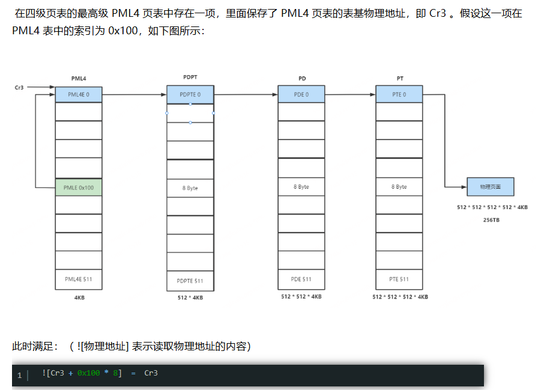
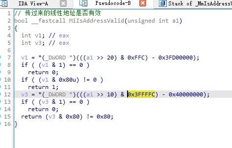

# PAE
为了扩大内存，出现了PAE，来支持36跟地址总线，并衍生了2-9-9-12分页

# 2-9-9-12分页：页目录表（PDPT）、页目录（PDT）、页表（PTT）

## PDPTE格式

## cr3 
cr3指向了PDPT
## 分页
线性地址按2-9-9-12拆分成四部分，前三部分2-9-9用来找到真实地址页基址，最后一部分12是偏移。不同的是页目录表、页目录、页表中的每一项都是8字节64位，但只用了36位，页目录表有4项，页目录、页表都变成了拥有512项

# 页表自映射
在64位模式下，高等级页表项都指向低等级页表项的物理地址，依次类推，直到最低级别页表项，即可获取物理页面进而读取内容。在此过程中 Cr3 寄存器中存储了最高级页表（PML4）的表基物理地址。为了更好的管理这些页表，微软采取了最高级页表基址自映射的方式实现仅仅利用8字节物理内存，就可以在每次访问分页管理相关的内存时，少做一次页表查询操作来优化速度。

# 作业
ida 跟32位内核MmIsAddressValid函数
