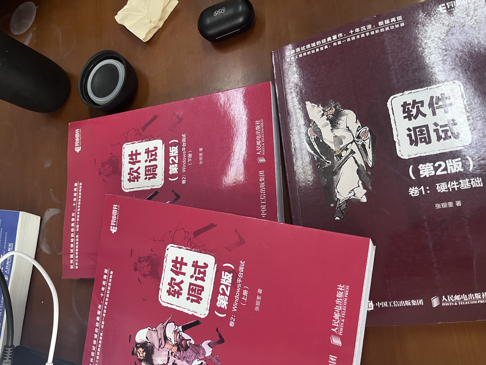

# windows内核实验笔记

## 教程看的是火哥6期，每章会写自己的思考和作业

## 6期视频教程不完整，在“缓存”这一集转到5期

## 结合《软件调试》三本书作为补充

## 在驱动通信这集开始听不懂，用海哥内核作为辅助，海哥讲的更清楚一点，火哥的可以跟着敲代码、做实验

## 止步在内存加载，讲的太乱了，换成别的教程，os，重新来过，笔记停更，删除，仅留一份在github用作警示！