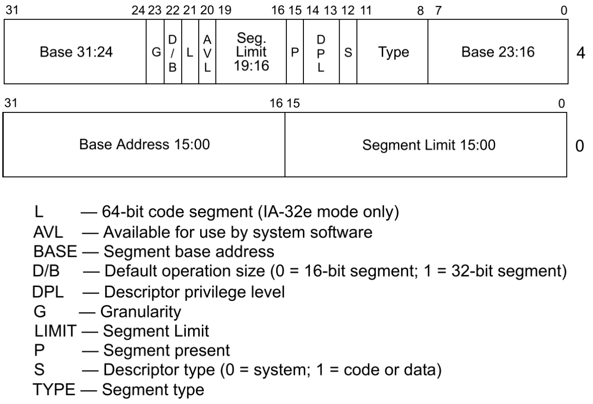
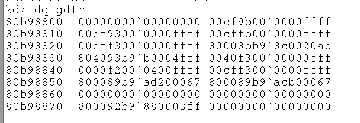

# windbg 命令
## 查看寄存器
r gdtr
## 查看地址的内存
### 注意显示出来的内存全是小端序
db/dw/dd/dq gdtr [l 0x20]

# 心得
## 段
进入保护模式后，段描述符表是一个指针数组，存放着每一个描述符的指针，每个描述符包括了它可以覆盖的真实内存地址的范围以及权限信息，比如通过这个描述符找到的地址是仅仅可读或是可读、可写、可执行...而段寄存器存储了段描述符表这个指针数组的索引，所以段寄存器加上偏移以及设置好的描述符就可以访问任意内存。
## 解析描述符

### 以00cf9b00`0000ffff为例子
|  key   | value  |
|  ----  | ----  |
|limit| fffff |
|base| 00000000 |
|type| b |
|S| 1 |
|DPL| 0 |
|P| 1 |
|AVL| 0 |
|DEF（恒为0）| 0 |
|D/B| 1 |
|G（ 1代表以页为单位，0代表以字节为单位）| 1 |

# 作业

## 00cf9300`0000ffff
|  key   | value  |
|  ----  | ----  |
|limit| fffff |
|base| 00000000 |
|type| 3 |
|S| 1 |
|DPL| 0 |
|P| 1 |
|AVL| 0 |
|DEF| 0 |
|D/B| 1 |
|G| 1 |

## 00cffb00`0000ffff
|  key   | value  |
|  ----  | ----  |
|limit| fffff |
|base| 00000000 |
|type| b |
|S| 1 |
|DPL| 3 |
|P| 1 |
|AVL| 0 |
|DEF| 0 |
|D/B| 1 |
|G| 1 |
## 80008bb9`8c0020ab
|  key   | value  |
|  ----  | ----  |
|limit| 020ab |
|base| 80b98c00 |
|type| b |
|S| 0 |
|DPL| 0 |
|P| 1 |
|AVL| 0 |
|DEF| 0 |
|D/B| 0 |
|G| 0 |

## 804093b9`b0004fff
|  key   | value  |
|  ----  | ----  |
|limit| 04fff |
|base| 80b9b000 |
|type| 3 |
|S| 1 |
|DPL| 0 |
|P| 1 |
|AVL| 0 |
|DEF| 0 |
|D/B| 1 |
|G| 0 |

## 800092b9`880003ff
|  key   | value  |
|  ----  | ----  |
|limit| 003ff |
|base| 80b98800 |
|type| 2 |
|S| 1 |
|DPL| 0 |
|P| 1 |
|AVL| 0 |
|DEF| 0 |
|D/B| 0 |
|G| 0 |